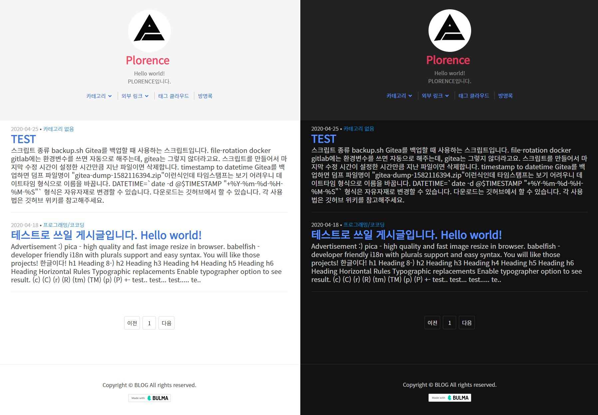

# Plore

  
개발자와 잘 어울리는 티스토리 스킨입니다.  
마크다운으로 쓰는 포스트에 초점이 맞추어져 있습니다.  

# 목차
<ul class="menu-list"><li><a href="#특징">특징</a><ul><li><a href="#브라우저-호환">브라우저 호환</a></li><li><a href="#Google-PageSpeed-Insights">Google PageSpeed Insights</a></li></ul></li><li><a href="#설치">설치</a><ul><li><a href="#설정-가이드">설정 가이드</a></li><li><a href="#빌드하기">빌드하기</a></li><li><a href="#빌드-툴-설치">빌드 툴 설치</a></li></ul></li><li><a href="#기여-정책">기여 정책</a></li><li><a href="#라이센스">라이센스</a></li></ul>

# 특징
+ 반응형으로 PC와 모바일 환경에서 전시됩니다. 
+ `BETA` 다크 모드를 지원합니다. (스킨 옵션; 브라우저 지원 필요)
+ 닉네임 옆 무슨 개발자인지 쓸 수 있음. (스킨 옵션)
+ 소셜 버튼 지원 (스킨 옵션; Stackoverflow, Github, Reddit ... )
+ 글 내용에 집중할 수 있도록 스파이 메뉴만 제외하고 별도의 좌우 컨텐츠를 뺐습니다.
  + 꾸미기 -> 사이드바를 사용하지 않음
  + 꾸미기 -> 메뉴를 사용하지 않음
+ 글 스타일이 Github와 흡사하여 친숙합니다.
+ 글을 읽기의 예상 소요 시간이 제공됩니다.
+ [Bulma](https://bulma.io/) 사용.
+ jQuery 미사용.

## 브라우저 호환
|브라우저|호환|테스트 버전|
|--------|----------|----------|
|IE| O | 10 |
|Chrome| O | 90.0.4430.212 |
|Edge| O | 90.0.818.56 |
|Safari | O | 10 |

## Google PageSpeed Insights
- [0.2.0](https://github.com/zxc010613/plore/blob/master/changelog.0.N.N.md#google-pagespeed-insights020)

# 설치

1. [Release](https://github.com/binchoo/plore/releases)> 최신 버전 파일 다운로드> 압축 해제
3. 본인 티스토리 블로그 관리> 꾸미기> 스킨 편집> 스킨 등록 버튼 클릭
5. 압축 해제한 파일들을 정확한 위치에 업로드
6. 스킨 이름을 적절히 설정하여 저장
7. 새로 등록된 스킨에 마우스를 올림> 적용 버튼을 클릭합니다.

## 설정 가이드

+ 콘텐츠> 설정> 단락 앞뒤에 공백: `사용하지 않습니다`
+ 꾸미기> 모바일> 티스토리 모바일웹 자동 연결: `사용하지 않습니다`
+ 플러그인> 위치로그 표시: `해제`
+ 플러그인> 카테고리 글 더 보기: `해제` (해당 영역 UI 미구현 상태임)
+ 플러그인> 방문자 통계 그래프: `해제`
+ 플러그인> 배너 출력: `해제`
+ 플러그인> 태그 입력기: `해제`
+ 플러그인> 반응형 웹스킨 이미지 최적화: `적용`

## 빌드하기
빌드 툴을 사용하면 용량이 줄어듭니다.  

+ CSS, JS Minify
+ 사용되지 않는 스타일의 삭제  

## 빌드 툴 설치
1. [node.js](https://nodejs.org/ko/)홈페이지에서 `node.js`를 다운받습니다.
2. `프롬프트`를 실행합니다.
    ```bash
    cd build
    npm install
    npm run build
    ```
3. `release`폴더에 저장됩니다.

# 기여 정책
- PR 허용: https://github.com/binchoo/plore/
- PR 미허용: https://github.com/zxc010613/plore

# 라이센스
[MIT License](./LICENSE)
